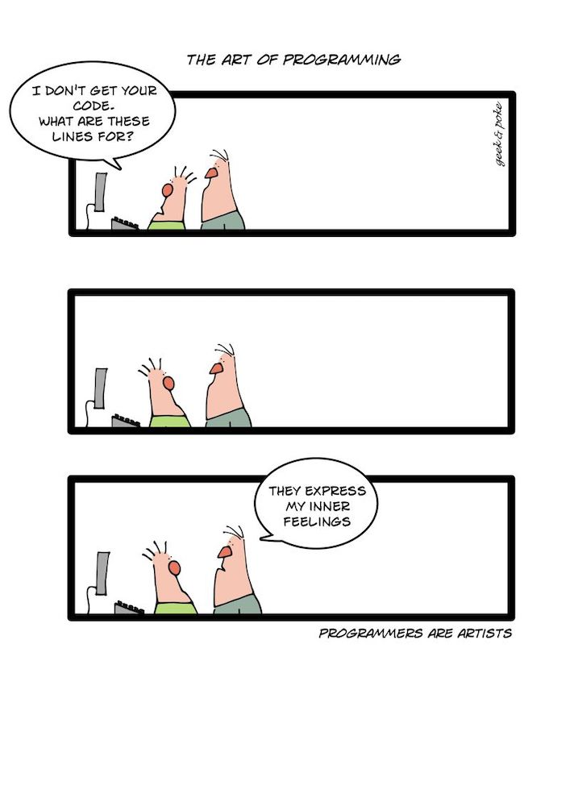

.. _introduction:
************
Introduction
************

This site can help student improve their math skills and get higher grades in math by practicing it.

.. toctree::
   :maxdepth: 1
   :glob:

   What is programming <what-is-programming>
   Goal of this book <goal-of-this-book>
